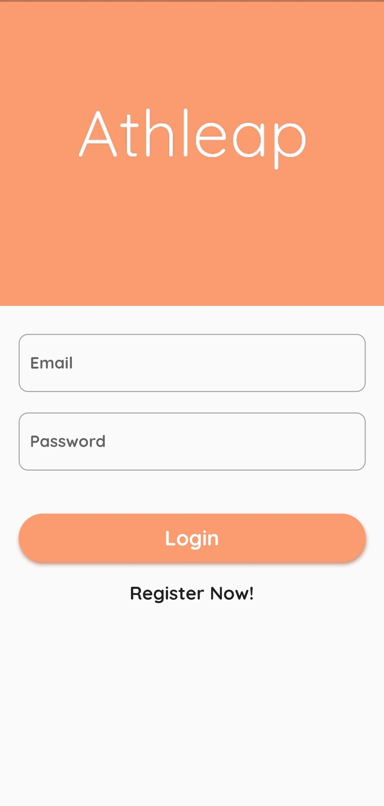
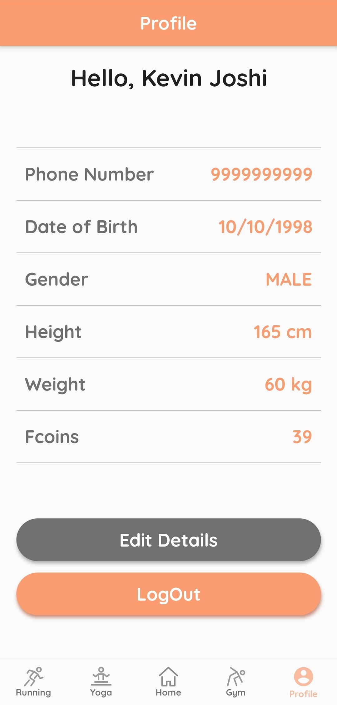
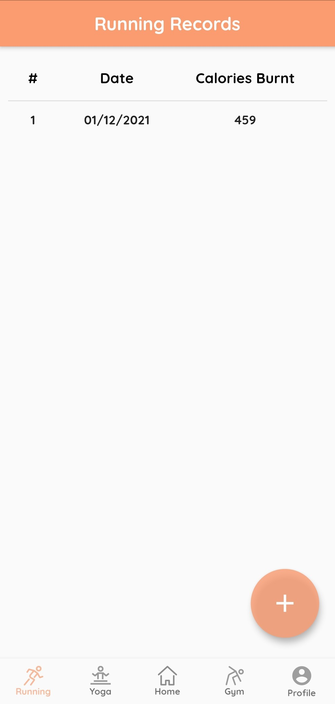

# ATHLEAP

This is a project made by [Kevin Joshi](https://github.com/KevinJ-hub), [Kaushal Binjola](https://github.com/KaushalBinjola) & [Rajas Bondale](https://github.com/Rajas-B).  
You can download the apk for your android device 📱 from [here](https://github.com/K-B-J/athleap_flutter/blob/master/android-releases/athleap_v1.0.1.apk). This project uses [Firebase](https://firebase.google.com) and various dependencies like [Flutter SVG](https://pub.dev/packages/flutter_svg), [Provider](https://pub.dev/packages/provider), [Flutter Spinkit](https://pub.dev/packages/flutter_spinkit) & [Scratcher](https://pub.dev/packages/scratcher).  
It is a **Flutter based Android app** that can help you **track the amount of calories you have burnt** 🔥 in majorly three types of fitness activities which are Gym 🏋️, Yoga 🧘 and Running 🏃. You will also be awarded with FCoins 🪙 (Fitness Coins) based on your performance which then can be used to claim prizes 🎁 from the shop.  

> **NOTE:** Since the app is not hosted on android playstore, play protect will not be able to recognise the app's developer so we request you to please ignore the warnings and not report the app while installing it on your android devices.  

## Tech Used

- Flutter
- Firebase

## Running this project

You can download the app from [here](https://github.com/K-B-J/athleap_flutter/blob/master/android-releases/athleap_v1.0.1.apk) and try it out on your own android device.  

OR  

1. Clone this repository
2. Run the following command in the root of the project to install the dependencies

```sh
$ flutter pub get
```

3. Run your android emulator or connect your physical device (after enabling developer options and USB debugging) and run the following command in the root of the project

```sh
$ flutter run
```

## Images

|  |  |  |  |
|---|---|---|---|
|  |  |  |  |
